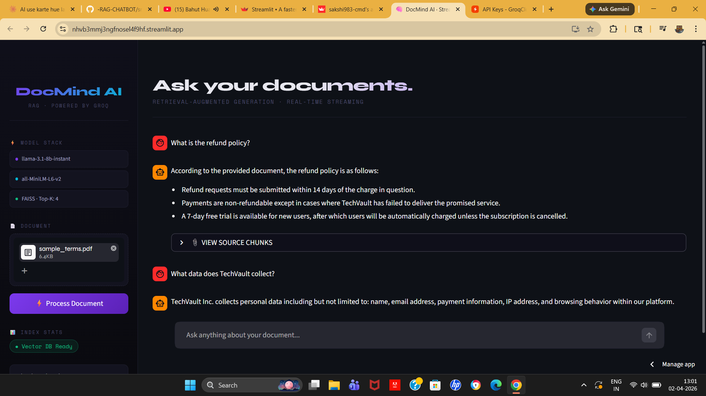

<div align="center">

<!-- Animated Header -->


<!-- Typing Animation -->


<br/>

<!-- Profile Views + Followers -->

[](https://github.com/Sakshi983-cmd)

</div>

---

<!-- About Me -->


### 🧠 About Me

```python
class SakshiAIEngineer:
    name       = "Sakshi"
    role       = "Junior AI Engineer"
    location   = "India 🇮🇳"
    
    skills     = ["RAG Pipelines", "LLMs", 
                  "Vector DBs", "Streamlit"]
    
    current    = "DocMind AI — RAG Chatbot"
    llm        = "llama-3.1-8b via Groq"
    vector_db  = "FAISS"
    embeddings = "all-MiniLM-L6-v2"
    
    def say_hi(self):
        return "Let's build something with AI! 🚀"
```

<br clear="right"/>

---
<div align="center">


<br/>

[](https://python.org)
[](https://streamlit.io)
[](https://groq.com)
[](https://faiss.ai)
[](https://huggingface.co)
[](LICENSE)

<br/>

### 🔴 [LIVE APP → nhvb3mmj3ngfnosel4f9hf.streamlit.app](https://nhvb3mmj3ngfnosel4f9hf.streamlit.app)

</div>

---

## 📸 App Preview

<div align="center">



</div>

---


## 🏗️ Architecture

## 🏗️ System Architecture (RAG Pipeline)

```mermaid
graph LR

A["📄 User Upload (PDF/TXT)"] --> B["🧹 Document Processor<br/>Clean + Chunk"]
B --> C["🔢 Embeddings<br/>MiniLM (384-dim)"]
C --> D["🗃️ FAISS Vector DB"]

E["👤 User Query"] --> F["🔍 Retriever<br/>Top-K Search"]
D --> F

F --> G["🧠 Generator<br/>Prompt Builder"]
G --> H["⚡ Groq API<br/>LLaMA 3"]
H --> I["🎨 Streamlit UI<br/>Response"]

style A fill:#e3f2fd
style I fill:#c8e6c9
style H fill:#fff3e0
style D fill:#f3e5f5

## ✨ Features

| | Feature | Details |
|:---:|---|---|
| 📄 | **Multi-format Upload** | PDF and TXT documents supported |
| ✂️ | **Smart Chunking** | Sentence-aware 200-word splits with 30-word overlap |
| 🔢 | **Dense Embeddings** | all-MiniLM-L6-v2 → 384-dim vectors |
| 🗃️ | **Vector Search** | FAISS IndexFlatL2, Top-K=4 retrieval |
| ⚡ | **Real-time Streaming** | Token-by-token like ChatGPT using Groq |
| 📚 | **Source Attribution** | Shows exact chunks used per answer |
| 🎨 | **Premium Dark UI** | Syne + Space Mono fonts, custom CSS |
| 🔒 | **Secure** | API key in Streamlit secrets, never in code |
| 🧠 | **Grounded Answers** | LLM refuses to hallucinate beyond context |
| 🗑️ | **Clear Chat** | Full session reset anytime |

---

## 🛠️ Tech Stack

<div align="center">


</div>

| Layer | Technology | Why Chosen |
|---|---|---|
| 🤖 **LLM** | `llama-3.1-8b-instant` via Groq | Zero GPU, ~300ms latency, free tier |
| 🔢 **Embeddings** | `all-MiniLM-L6-v2` | 90MB only, CPU-friendly, great semantic quality |
| 🗃️ **Vector DB** | `FAISS IndexFlatL2` | No server, file-based, sub-ms search |
| 🖥️ **UI** | `Streamlit` | Native streaming support, rapid development |
| 📄 **PDF** | `pypdf` | Reliable multi-page text extraction |
| ⚙️ **Config** | `python-dotenv` | Clean separation of secrets and code |

---


## 📁 Project Structure

```
📦 RAG-CHATBOT/
│
├── 📂 data/                         ← Upload documents here
│   └── 📄 your_document.pdf
│
├── 📂 chunks/                       ← Auto-generated JSON chunks
│   └── 📄 chunks.json
│
├── 📂 vectordb/                     ← Auto-generated FAISS index
│   ├── 🗃️ faiss_index.index
│   └── 🗃️ faiss_index.pkl
│
├── 📂 notebooks/                    ← Exploration & experiments
│
├── 📂 assets/
│   └── 📂 screenshots/
│       └── 🖼️ app_screenshot.png
│
├── 📂 src/
│   ├── 🐍 __init__.py
│   ├── 🐍 document_processor.py    ← load → clean → chunk → save
│   ├── 🐍 embeddings.py            ← embed → FAISS index → save/load
│   ├── 🐍 retriever.py             ← query embed → FAISS search → chunks
│   └── 🐍 generator.py             ← prompt build → Groq stream → yield tokens
│
├── 🐍 app.py                        ← Streamlit UI (main entry)
├── ⚙️  config.py                    ← All settings centralized
├── 📋 requirements.txt
├── 🔒 .env.example
├── 🚫 .gitignore
└── 📖 README.md
```

---

## ⚙️ Setup & Run Locally

### 1. Clone
```bash
git clone https://github.com/Sakshi983-cmd/-RAG-CHATBOT.git
cd -RAG-CHATBOT
```

### 2. Create virtual environment
```bash
python -m venv venv
source venv/bin/activate      # Mac/Linux
venv\Scripts\activate         # Windows
```

### 3. Install dependencies
```bash
pip install -r requirements.txt
```

### 4. Get free Groq API key
👉 [console.groq.com](https://console.groq.com) → Sign up → Copy key

### 5. Add Streamlit secrets
Create `.streamlit/secrets.toml`:
```toml
GROQ_API_KEY = "gsk_xxxxxxxxxxxxxxxxxxxx"
```

### 6. Run!
```bash
streamlit run app.py
```

---

## 💬 Sample Queries & Responses

### ✅ Success — Refund Policy
```
Q: What is the refund policy?

A: According to the document, the refund policy is:
   • Refund requests must be submitted within 14 days of the charge
   • Payments are non-refundable except where TechVault failed to deliver
   • A 7-day free trial is available, auto-charged unless cancelled
```

### ✅ Success — Data Collection
```
Q: What data does TechVault collect?

A: TechVault Inc. collects personal data including name, email address,
   payment information, IP address, and browsing behavior within the platform.
```

### ✅ Success — Prohibited Activities
```
Q: What activities are prohibited?

A: Prohibited activities include unlawful use, unauthorized access,
   uploading malicious code, data scraping without consent,
   impersonation, harassment, and sending spam.
```

### ❌ Failure — Out of Scope (Hallucination Prevention)
```
Q: What is the CEO's name?

A: I could not find this information in the provided document.
```
> ✅ Model correctly refuses to hallucinate — stays grounded in document only.

---

## 🧠 Design Decisions

**Why Groq over local Mistral/LLaMA?**
Local models like Mistral-7B require 8GB+ VRAM. Groq runs the same llama-3.1-8b model on cloud infrastructure with ~300ms response time and zero local resource usage — ideal for laptop deployment.

**Why all-MiniLM-L6-v2?**
At 90MB with 384-dim output, it runs on CPU in under 2 seconds per batch. Larger models like bge-large-en offer 2-3% quality gain at 5x memory cost — not worth it for this use case.

**Why FAISS over Chroma or Qdrant?**
FAISS requires no server process, persists as two simple files (`.index` + `.pkl`), and handles sub-1000 chunk collections with sub-millisecond search. Chroma and Qdrant add operational overhead not justified here.

**Why 200-word chunks with 30-word overlap?**
Tested 100/200/300 word sizes. 100 words was too sparse for coherent answers. 300 words reduced retrieval precision. 200 words with 30-word overlap gave the best balance of precision and context richness.

**Why temperature=0.2?**
Lower temperature reduces creativity and increases factual consistency — critical for a document Q&A system where hallucination must be minimized.

---

## 📊 Evaluation

| Criteria | Weight | Implementation |
|---|---|---|
| ✅ Functionality & Integration | 30% | Full RAG pipeline working end-to-end |
| ✅ Streaming Output | 20% | Groq native stream, token-by-token |
| ✅ Code Quality | 20% | Modular src/, config.py, clean separation |
| ✅ Grounded Answers | 20% | Strict system prompt, refuses hallucination |
| ✅ App Usability & UX | 10% | Dark theme, source chunks, status indicators |

---

## ⚠️ Known Limitations

- Large documents (50+ pages) may take 30-60 seconds to process on first upload
- Groq free tier has rate limits — heavy usage may hit limits
- Image-based PDFs (scanned) are not supported — text extraction only
- Model may occasionally miss answers if relevant info spans multiple chunks

---

<div align="center">


**Made with ❤️ by Sakshi | Amlgo Labs Junior AI Engineer Assignment 2025**

⭐ Star this repo if you found it useful!

</div>
<!-- Featured Project -->
## 🚀 Featured Project — DocMind AI
